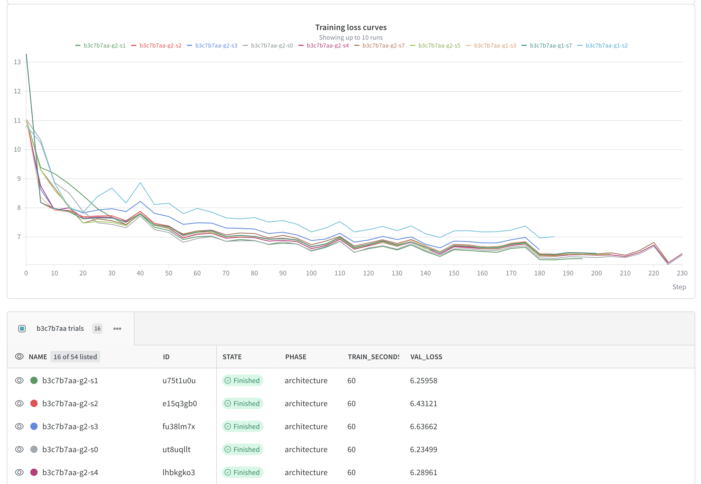
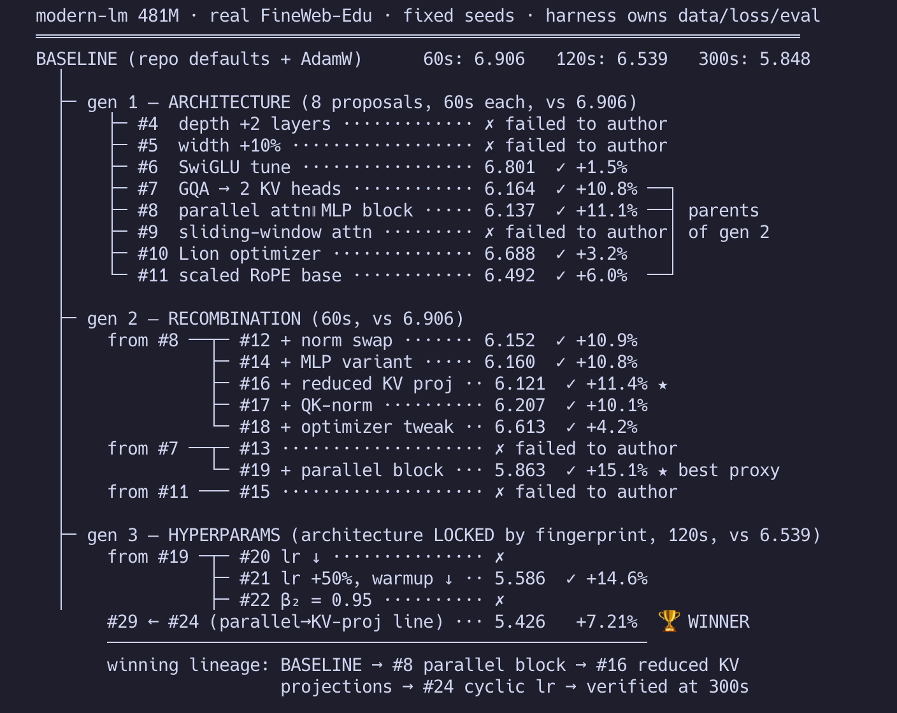

# Top-Kernel

[**Open the website ↗**](https://top-kernel-demo.andre520395.chatgpt.site/?demo=1)

**Evolutionary search over training recipes and Triton kernels, run by LLM agents, judged only by deterministic measurement.**

[](https://www.python.org/)
[](https://pytorch.org/)
[](https://github.com/triton-lang/triton)
[](https://wandb.ai/rianbutala-ucla/kernel-evolution)
[](https://huggingface.co/datasets/HuggingFaceFW/fineweb-edu)
[](https://molab.marimo.run)



Point it at any PyTorch repo on GitHub. An adapter agent figures out how to run
one training step of the repo's model — real data pipeline included — then an
evolutionary loop takes over: a planner proposes strategies, parallel coding
agents implement them, and a **deterministic harness** trains, verifies, and
ranks every candidate. Two search modes share the machinery:

- **Recipe evolution** — architecture and optimizer generations, then
  hyperparameters with the architecture frozen by parameter fingerprint, then
  matched-budget finals. Signal: held-out validation loss at fixed wall-clock.
- **Kernel evolution** — agent-written Triton kernels for the model's hot ops,
  accepted only through a four-gate verifier: compiles → matches eager outputs
  **and gradients** → beats the `torch.compile` incumbent in isolation → speeds
  up the real training step.

No model ever grades its own output. Correctness is a constraint, not an
objective.

## Results

| Workload | Mode | Result | Evidence |
|---|---|---|---|
| modern-lm (481M baseline, FineWeb-Edu) | Recipe | **−7.21% val loss** at matched 300s wall-clock (5.848 → 5.426). Winner is a **298M-param** recipe — shrinking within the param cap is legal and buys more optimizer steps at fixed wall-clock, so this is a *recipe* win at this horizon, not a like-for-like architecture win | run `75890bd0` |
| modern-lm (481M baseline, FineWeb-Edu) | Recipe | **−4.85% val loss** at matched 300s (5.522 → 5.255, ≈23% perplexity), $24.39 total LLM spend; winner **382M params** | run `b3c7b7aa` |
| karpathy/nanochat | Kernel | Agent-written Triton RMSNorm: training step **8.95 → 8.58 ms** vs the `torch.compile` incumbent = **−4.1%**; vs eager (8.73 ms, faster than inductor on this launch-bound step) = **−1.7%** (RTX PRO 6000) | run `29b07762` |
| Verifier self-test | Kernel | Two planted cheating kernels (output-caching, shape-hardcoded) rejected at gate 2 in **every** kernel-mode calibration (9/9 rows); the run aborts if either slips through. Recipe mode uses different gates (load / param cap / arch-lock / sanity) with no calibration step | kernel archives |

Per-candidate training curves stream to W&B — every candidate is its own run,
grouped by job, so the whole generation is inspectable live (see the chart
above). Selection compounds across generations. The −7.21% winner's lineage: baseline
→ parallel attention∥MLP block (+11.1% proxy) → reduced KV projections
(+11.4%) → cyclic learning rate → re-verified at the full finals budget:



Twice now, the best short-budget candidate has **lost** the matched-budget
finals — the staged design catching horizon overfitting instead of shipping
it. Failures are first-class output: the adapter agent's fail→repair→verified
trail is a panel in the UI and a table in W&B, and infrastructure failures are
tagged `[infra]` so the planner never learns false lessons from harness bugs.

## How it works

```
repo ──▶ adapter agent ──▶ profile ──▶ calibrate ──▶ ┌ planner ─▶ subagents ─▶ verifier gates ┐
        (writes+debugs      (hot ops    (noise floor, │            ▲                   │        │
         the harness         become      planted-cheat│            └─── lessons ◀─ curator ◀────┘
         contract)           lineages)   self-test)   └───────── generations ──────────────────┘
```

Engineering choices that keep the numbers honest:

- **Calibration, not constants** — noise floors and numeric tolerances are
  measured on the actual machine at startup; acceptance margins only ever
  tighten.
- **In-session baselines** — incumbents are re-measured live, never compared
  against stored numbers.
- **Harness owns everything gameable** in recipe mode: data, loss, validation
  set, seeds, budgets, a parameter cap, and an architecture-lock fingerprint.
- **Raw-feedback repair** — failed candidates get the compiler error or
  numeric mismatch verbatim (no diagnosis) and a bounded number of retries.
- **Process-level liveness** — workers are reaped the instant they print their
  result, heartbeat during long stages, and are killed on silence, so a hung
  candidate can't stall the loop.
- **Fixed op vocabulary** — models are routed onto known ops (norms, gated
  MLPs, cross-entropy, …) by *behavioral* probing, never by class names. No
  per-repo code, no runtime vocabulary growth.

## Quickstart

```bash
uv pip install -r requirements.txt
cp .env.example .env        # fill in keys (a W&B key covers logging + inference)

uv run python web.py        # http://127.0.0.1:8420 — submit a repo, pick a mode,
                            # watch generations, self-repair trail, and lineage live
# or headless:
uv run python search.py --repo https://github.com/xerneas3318/modern-lm --mode recipe
uv run python search.py --repo https://github.com/karpathy/nanochat --profile DEV
uv run python search.py --adapter adapters/jepa.py --llm stub   # $0 harness smoke test
```

Needs a CUDA GPU. Runs locally or on a [molab](https://molab.marimo.run)
notebook — paste the notebook's "Pair with agent" prompt into the web form and
jobs are dispatched, streamed, and synced back automatically (mid-run, so a
dying sandbox can't take winning code with it).

Observability: per-candidate runs, metrics, and artifacts in
[W&B](https://wandb.ai/rianbutala-ucla/kernel-evolution); every LLM call and
candidate lifecycle traced in Weave; authoritative state in a local SQLite
archive (`marimo run notebooks/viewer.py`).

## Layout

| Path | What it is |
|---|---|
| `search.py` / `web.py` | CLI entry / job frontend |
| `kernelevo/` | The harness: op registry + behavioral routing, verifier gates and subprocess workers, planner/subagent/curator/researcher agents, adapter-writing agent, recipe loop, molab dispatch, SQLite archive |
| `adapters/` | Bundled demo models (JEPA, small LM) |
| `findings/` | Run ledger, harness-bug log, performance analysis, agent-behavior notes |
| `config.py` | `DEV` (smoke) and `RUN` (real search) profiles |

## Scope and honesty

Single GPU, single node, full training steps only (forward → loss → backward →
optimizer). Attention, convolutions, and embedding lookups are deliberately
out of kernel-search scope. Recipe results are wins *at the evaluated
wall-clock horizon* — the search optimizes whatever budget you configure, and
the staged finals exist precisely because short-horizon winners don't always
transfer. `findings/` documents every harness bug we hit, including the ones
that were our fault.
