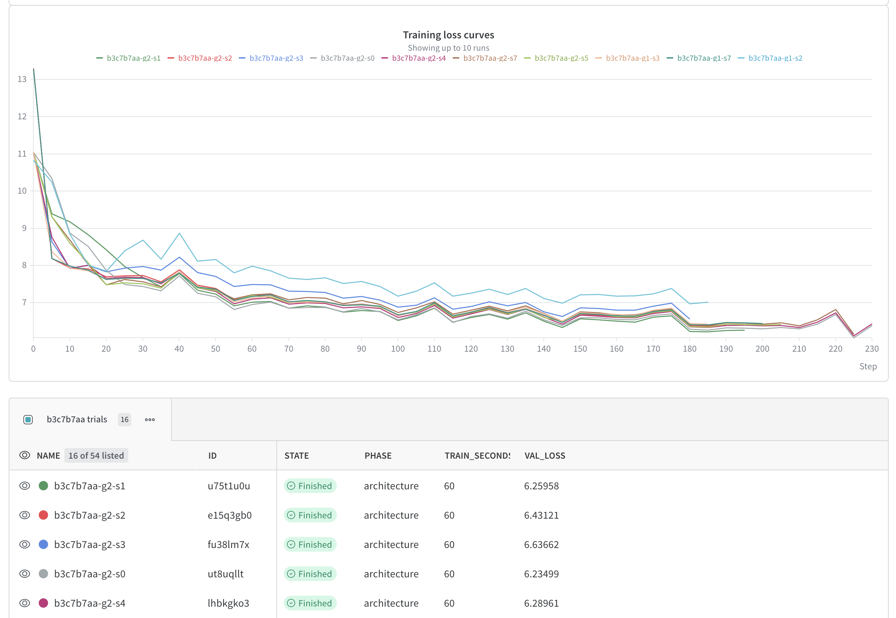
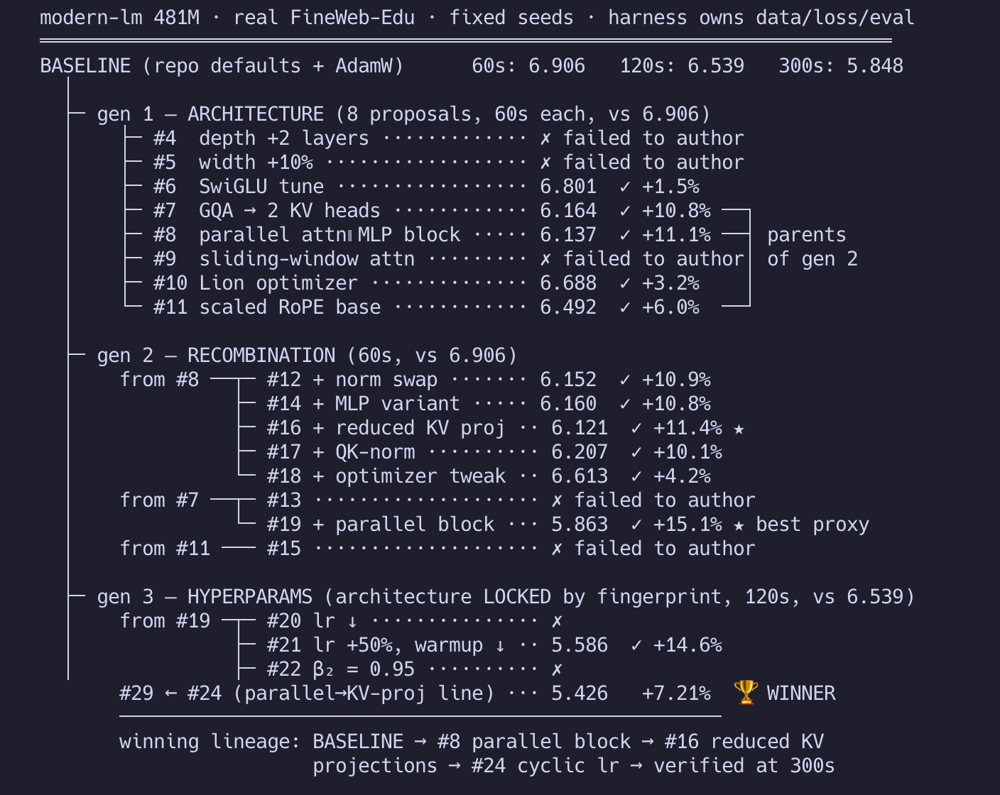

# Top-Kernel

[**Open the website ↗**](https://top-k.dev)

**Evolutionary search over training recipes and Triton kernels, run by LLM agents, judged only by deterministic measurement.**

[](https://www.python.org/)
[](https://pytorch.org/)
[](https://github.com/triton-lang/triton)
[](https://wandb.ai/rianbutala-ucla/kernel-evolution)
[](https://huggingface.co/datasets/HuggingFaceFW/fineweb-edu)
[](https://molab.marimo.run)



Point it at any PyTorch repo on GitHub. An adapter agent figures out how to run
one training step of the repo's model — real data pipeline included — then an
evolutionary loop takes over: a planner proposes strategies, parallel coding
agents implement them, and a **deterministic harness** trains, verifies, and
ranks every candidate. Two search modes share the machinery:

- **Recipe evolution** — architecture and optimizer generations, then
  hyperparameters with the architecture frozen by parameter fingerprint, then
  matched-budget finals. Signal: held-out validation loss at fixed wall-clock.
- **Kernel evolution** — agent-written Triton kernels for the model's hot ops,
  accepted only through a four-gate verifier: compiles → matches eager outputs
  **and gradients** → beats the `torch.compile` incumbent in isolation → speeds
  up the real training step.

No model ever grades its own output. Correctness is a constraint, not an
objective.

## Verified highlights

| Project | Search | Measured improvement |
|---|---|---|
| timm | Kernels + architecture | **9.499% lower step time** · **4.535% lower validation loss** |
| Diffusers | Architecture | **13.324% lower validation loss** at equal training time |
| nanochat | Kernels | **1.736% lower step time** against the compiled baseline |
| modern-lm | Recipe | **4.85% lower validation loss** at 300 seconds, with the same 481M parameter count |

The first three rows use deterministic synthetic batches on an RTX PRO 6000.
They measure the tested workload, not downstream accuracy. modern-lm uses
FineWeb-Edu. [View successful experiments and evidence](findings/README.md).



## How it works

```
repo ──▶ adapter agent ──▶ profile ──▶ calibrate ──▶ ┌ planner ─▶ subagents ─▶ verifier gates ┐
        (writes+debugs      (hot ops    (noise floor, │            ▲                   │        │
         the harness         become      planted-cheat│            └─── lessons ◀─ curator ◀────┘
         contract)           lineages)   self-test)   └───────── generations ──────────────────┘
```

Engineering choices that keep the numbers honest:

- **Calibration, not constants** — noise floors and numeric tolerances are
  measured on the actual machine at startup; acceptance margins only ever
  tighten.
- **In-session baselines** — incumbents are re-measured live, never compared
  against stored numbers.
- **Harness owns everything gameable** in recipe mode: data, loss, validation
  set, seeds, budgets, a parameter cap, and an architecture-lock fingerprint.
- **Raw-feedback repair** — failed candidates get the compiler error or
  numeric mismatch verbatim (no diagnosis) and a bounded number of retries.
- **Process-level liveness** — workers are reaped the instant they print their
  result, heartbeat during long stages, and are killed on silence, so a hung
  candidate can't stall the loop.
- **Fixed op vocabulary** — models are routed onto known ops (norms, gated
  MLPs, cross-entropy, …) by *behavioral* probing, never by class names. No
  per-repo code, no runtime vocabulary growth.

## Run it from CLI

The website is a static frontend with project information and measured examples.
Searches run through the CLI on your own machine. To run a search,
use a Linux machine with a CUDA GPU and Python 3.11+:

```bash
git clone https://github.com/flappybird1084/top-k.git
cd top-k
uv venv --python 3.11
uv pip install -r requirements.txt
cp .env.example .env        # set WANDB_API_KEY for W&B logging and inference

.venv/bin/python search.py --repo https://github.com/karpathy/nanoGPT --mode recipe --profile RUN --llm wandb
.venv/bin/python search.py --repo https://github.com/karpathy/nanoGPT --mode kernel --profile RUN --llm wandb
```

Each CLI command runs one mode. Run the two commands sequentially to search
both domains; `search.py` has no `both` mode. The CLI writes a timestamped
directory under `runs/` and logs candidates to W&B. Use `--comments` for repo
guidance, `--spend-cap` for an inference budget, and `--out` to choose the output
directory. See `.venv/bin/python search.py --help` for all options. Do not put
API keys on the command line.

Observability: per-candidate runs, metrics, and artifacts in
[W&B](https://wandb.ai/rianbutala-ucla/kernel-evolution); every LLM call and
candidate lifecycle traced in Weave; authoritative state in a local SQLite
archive (`marimo run notebooks/viewer.py`).

## Layout

| Path | What it is |
|---|---|
| `search.py` / `web.py` | CLI entry / job frontend |
| `kernelevo/` | The harness: op registry + behavioral routing, verifier gates and subprocess workers, planner/subagent/curator/researcher agents, adapter-writing agent, recipe loop, molab dispatch, SQLite archive |
| `adapters/` | Bundled demo models (JEPA, small LM) |
| `findings/` | Successful experiments, metrics, and reproducible evidence |
| `config.py` | `DEV` (smoke) and `RUN` (real search) profiles |

## Multi-repository benchmark

The [25-repository intake set and runner](benchmarks/README.md) pin public
repository commits, run one GPU job at a time with W&B Inference, and publish
the complete result table to W&B, including failures. A repository appears in
the intake set only as a candidate workload; measured improvements are recorded
per run after deterministic verification.

## Scope and honesty

Single GPU, single node, full training steps only (forward → loss → backward →
optimizer). Attention, convolutions, and embedding lookups are deliberately
out of kernel-search scope. Recipe results are wins *at the evaluated
wall-clock horizon* — the search optimizes whatever budget you configure, and
the staged finals exist precisely because short-horizon winners don't always
transfer. Full benchmark outcomes remain available in the linked machine-readable
evidence; the showcase highlights accepted improvements only.
